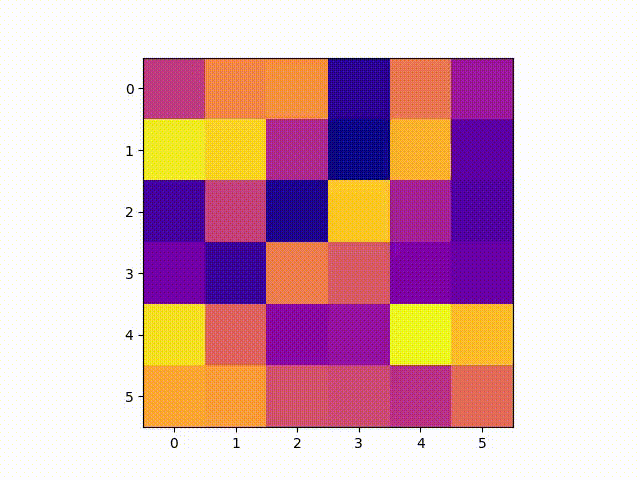

## 8-Puzzle

The 8-puzzle is a sliding puzzle that consists of a frame of numbered square tiles in random order with one tile missing. The object of the puzzle is to place the tiles in order by making sliding moves that use the empty space.

## Strategy

Moving a tile to the empty space is equivalent to moving the empty space to the tile. Therefore, at each step we can encode the possible actions as the four directions ["up", "down", "right", "left"] where the empty space can move (if possible).  
My implementation is based on the A* algorithm: the heuristic function $h(x)$ is the combination of the Manhattan distance (i.e. the sum of the distances of each tile from its correct position) and the linear conflict (i.e. the number of conflicts between tiles in the same row or column). This idea of linear conflict was taken from the following resource: https://algorithmsinsight.wordpress.com/graph-theory-2/a-star-in-general/implementing-a-star-to-solve-n-puzzle/.

## Visualizing animations

To correctly visualize the matplotlib animations, you need to open the repository locally. The animations are saved in the `animations` folder.

